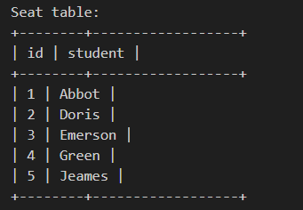
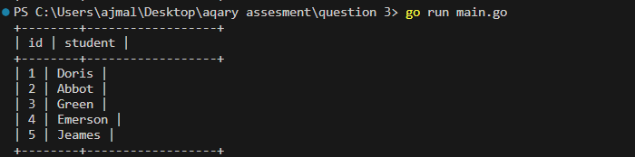
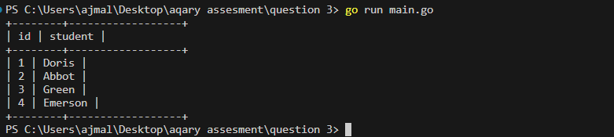

# aqary-question-3
Assesment question number 3 given by aqary international group

// code ncontains only the solution for the given question. adding values to the table is done manually
// environment variables are not added in gitignore for refernce purpose

question number 3:

id is the primary key (unique value) column for this table.

Each row of this table indicates the name and the ID of a student.

id is a continuous increment.

Write a solution to swap the seat id of every two consecutive students.
If the number of students is odd, the id of the last student is not swapped.
Return the result table ordered by id in ascending order.
The result format is in the following example.

Example 1:

Input:

output:

for odd number of students

for even number of students

